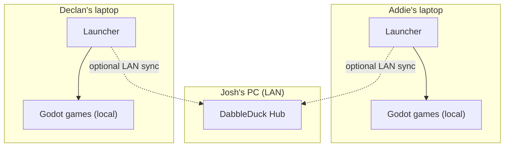
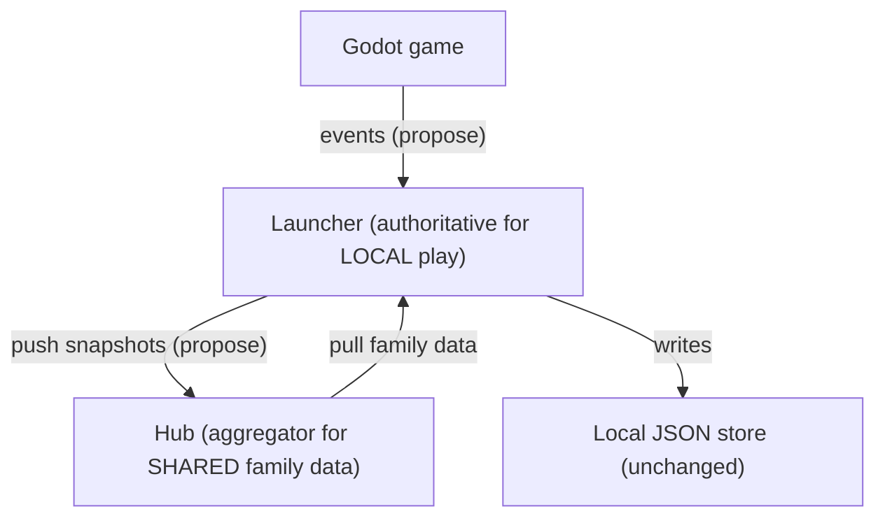
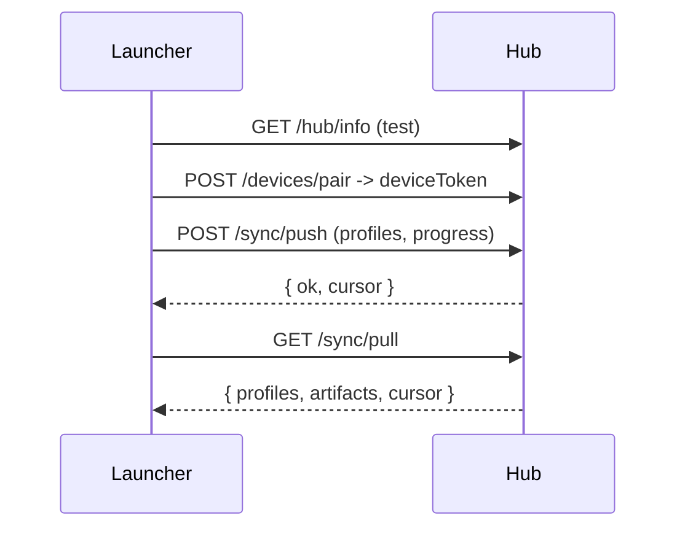

# DabbleDuck Hub — Architecture

> Status legend: **[Implemented]** working & verified (Phase 1) · **[Scaffolded]**
> present as a seam/skeleton · **[Planned]** designed, not built · **[Deferred]**
> intentionally out of scope for now.
>
> The Hub is an **optional enhancement**. DabbleDuck always works fully offline
> and standalone. If no Hub exists — or it is offline — every launcher keeps
> working locally and can sync later. This is the single most important
> constraint in this document.

---

## 1. Vision and purpose

DabbleDuck today is a local-first, child-safe launcher: each child's laptop runs
the launcher, launches Godot games locally, and stores profiles/progress in local
JSON files. (See [project-continuity-summary.md](../project-continuity-summary.md).)

The **DabbleDuck Hub** is a small, optional server that runs on one always-on
machine on the home LAN (e.g. Josh's PC). Its purpose is to **preserve and share
the family's creations and progress** across devices — not to host multiplayer.

The most valuable long-term data is not achievements — it is **artwork, stories,
saved creations, and family memories**. The architecture treats creations as
first-class, durable artifacts.

### Design goals

Local-first · no cloud · no internet required · family-owned data · child-safe ·
simple deployment · runs on older hardware · optional · future-ready (creations,
family gallery, and — much later — a multiplayer foundation).

---

## 2. Core principle: one more level of "propose, then decide"

The launcher is already the **single authoritative writer** of local
`progress.json`; games only *propose* changes via an append-only event log
(`src/main/gameReconciler.ts`). The Hub generalizes this one level up:

- Games → propose to the launcher (unchanged).
- Launchers → push to the Hub and pull family data (new, optional).
- The launcher remains authoritative for its own local store; the Hub is the
  aggregator of shared family data.

---

## 3. Technology choices

| Concern        | Choice                                   | Why |
| -------------- | ---------------------------------------- | --- |
| Backend        | **Node.js + TypeScript** **[Implemented]** | Reuse the launcher's pure data model + contract types; one language; trivial on old x86. |
| HTTP           | **Fastify** **[Implemented]**            | Tiny, fast, built-in JSON parsing/validation. |
| Database       | **SQLite via built-in `node:sqlite`** **[Implemented]** | Single-file, zero-admin, reliable — and **no native build**, which is the most reliable option across machines. Metadata only. |
| Blob storage   | **Filesystem** **[Implemented]**         | Artifact bytes as files; metadata in SQLite. Free durability + future de-dup. |
| Discovery      | **Manual IP/port** **[Implemented]**; mDNS **[Deferred]** | Keep Phase 1 boring; auto-discovery later. |

> Originally `better-sqlite3` was planned, but it requires native compilation
> that is unavailable/unreliable on target hardware. The built-in `node:sqlite`
> removes that dependency entirely. It is wrapped by a small adapter
> (`hub/src/db.ts`) so the driver can be swapped without touching routes.

---

## 4. Data ownership

| Data            | Authoritative owner            | Phase 1 sync                         | Conflict handling (Phase 1 → future) |
| --------------- | ------------------------------ | ------------------------------------ | ------------------------------------ |
| Profiles        | Hub (family roster) once paired | Pushed up; family roster pulled      | Last-write-wins by `updated_at` → richer merge |
| Progress        | Client (local), Hub aggregates | Pushed up (non-destructive)          | LWW by `updatedAt` → per-device monotonic merge |
| Achievements    | Inside progress                | Pushed with progress                 | Set-union by id (already deduped locally) |
| Artwork/creations/screenshots/stories/worlds | Hub shared library | Uploaded as files; metadata in sync | Immutable + content-addressed (future) → conflict-free |
| Settings (PIN, kiosk) | **Client only**          | **Never synced**                     | n/a — device-specific, PIN never leaves the device |

Phase 1 sync is **non-destructive**: the client pushes snapshots and *reads*
family data, but does not overwrite local data from a pull. This guarantees a
Hub round-trip can never clobber a child's local progress.

---

## 5. Synchronization

Phase 1 is a simple, conservative push + pull:

- **First install / pairing:** enable Hub → test → pair (stores a device token).
- **Manual sync:** push local snapshots, then pull family data.
- **Offline / unreachable:** every call fails gracefully; local play continues.

**Future-proofing seams (present but minimally used):** a `change_log` table and
a `cursor` on push/pull responses are the seam for incremental, resumable sync;
`ArtifactMeta.contentHash` for immutable content-addressed storage;
`ArtifactMeta.deletedAt` for soft-delete tombstones. **[Scaffolded]**

Automatic background sync, outbox queuing, cursor-based deltas, and conflict
merge are **[Planned]** for later phases.

---

## 6. Family features (the Hub's primary purpose)

All built on two Hub primitives: the **shared artifact library** and the
**change-log**. **[Planned]** for the next milestone after this foundation:

- Shared **Artwork Gallery**, **Story Library**, **Creation Library** — views
  over the artifact store filtered by type.
- **Family Achievement Wall** — aggregate of every profile's badges/achievements.
- **Family Timeline** — child-friendly feed of the change-log ("Addie made a
  drawing!", "Declan earned Snake Star!").
- **Sticker messages / child-safe communication** — constrained-vocabulary,
  asynchronous, no free text. **[Planned]**

The artifact model (`ArtifactMeta`, the `artifacts` table, and `/artifacts`
routes) exists now precisely so these features can be built without rework — and
so **Doodle Pond** saves have a home the day they are built.

---

## 7. Future multiplayer (design-for, do not build) — **[Deferred]**

The current launcher↔game contract is file-based and turn/result oriented — not
real-time. The Hub leaves a clean path without building anything:

- The Hub is already a long-running LAN service; a future realtime channel
  (WebSocket lobby/relay) can be added alongside the HTTP API.
- The wire contract is versioned (`HUB_PROTOCOL_VERSION`), so realtime is an
  additive v2 capability; games would opt in via a manifest flag.

Nothing real-time ships now. We only avoid architectural dead-ends.

---

## 8. Security — **[Implemented, simple/LAN-only]**

- **Device-based trust:** a device pairs once (`POST /devices/pair`) and receives
  a device token; protected routes require the `x-dabble-device-token` header.
- **Optional pairing code** (`DABBLE_HUB_PAIRING_CODE`): when set, devices must
  match it to pair.
- **Parent vs child:** Hub settings live behind Parent Mode (PIN) on each client.
- **LAN-only:** no internet dependency, no public exposure, no accounts, no
  passwords, no cloud auth. Run on a trusted home network.

Hardened auth, TLS, and per-route authorization are **[Planned]** only if needed.

---

## 9. Backup and recovery — **[Planned]**

- The entire Hub state is a single portable directory (`dabbleduck-hub-data/`:
  `hub.sqlite` + `artifacts/`). Back it up by copying that directory.
- **Automatic backups** (scheduled SQLite checkpoint + artifact snapshot into
  `backups/`) are scaffolded by the directory layout and planned for a later phase.
- **Hardware replacement:** move `dabbleduck-hub-data/` to the new machine and
  re-point clients (re-enter IP, or re-pair). Because clients keep local copies
  and creations are immutable, the data survives across multiple redundancy
  layers (client local + Hub + Hub backup).

---

## 10. Hardware recommendations

| Option            | Power | Reliability | Simplicity | Notes |
| ----------------- | ----- | ----------- | ---------- | ----- |
| **Mini PC (N100)** | very low | high | high | **Recommended primary.** Silent, x86, cheap, SSD. |
| Old Dell PC       | higher | medium | high | Great free starting point (this phase). Aging disks. |
| Raspberry Pi 4/5  | lowest | medium | medium | Boot from SSD, not SD. Fine for light load. |
| NAS (Synology…)   | low | very high | medium | Best for data safety + as a backup target. Run in Docker. |
| Full home server  | high | high | low | Overkill for family scale. |

Recommended path: prototype on the **old Dell PC** now → settle on an **N100 mini
PC** → use a **NAS** as the backup destination.

---

## 11. Migration roadmap

| Phase | Scope | Status | Complexity / Risk |
| ----- | ----- | ------ | ----------------- |
| 1 | **Hub foundation** (service, SQLite, artifacts, foundational API, client settings, manual sync) | **[Implemented]** | med / low |
| 2 | Doodle Pond + creation persistence (client) | [Planned] | med / low |
| 3 | Local gallery | [Planned] | low / low |
| 4 | Family gallery (Hub-backed) | [Planned] | med / low |
| 5 | Family timeline | [Planned] | med / low |
| 6 | Incremental sync (cursors, outbox, soft deletes, immutable artifacts) | [Planned] | med-high / med |
| 7 | Multiplayer foundation | [Deferred] | high / high |

---

## 12. What Phase 1 delivered (verified)

Implemented and verified locally:

- `hub/` Node service: boots, creates `dabbleduck-hub-data/`, initializes SQLite +
  artifact dirs, logs a clear startup banner. **[Implemented]**
- API: `/health`, `/hub/info`, `/devices/pair`, `/profiles`, `/sync/push`,
  `/sync/pull`, `/artifacts`, `/artifacts/:id` — exercised end-to-end (pair →
  token-protected push/pull with cursor → artifact upload/hash/fetch). **[Implemented]**
- Launcher: optional `hub` settings, `src/main/hubClient.ts`, IPC, and the
  "Family Hub (optional)" Parent Mode card (Test / Pair / Sync). **[Implemented]**
- Shared types: `src/shared/dataModel.ts` + `src/shared/hubContract.ts`, reused by
  both launcher and Hub. **[Implemented]**

Non-regression verified:

- Launcher typecheck + production build pass.
- Godot contract verification passes (`npm run verify:godot`).
- With the Hub disabled, the launcher behaves exactly as before.

### Explicitly NOT in Phase 1

Multiplayer, real-time co-op, mDNS discovery, incremental/conflict-merge sync,
immutable-artifact versioning, soft-delete UI, family gallery/timeline UI, and
automatic backups. These are designed-for via seams but not implemented.

See [../hub-development.md](../hub-development.md) and
[../../hub/README.md](../../hub/README.md) for how to run and develop the Hub.
